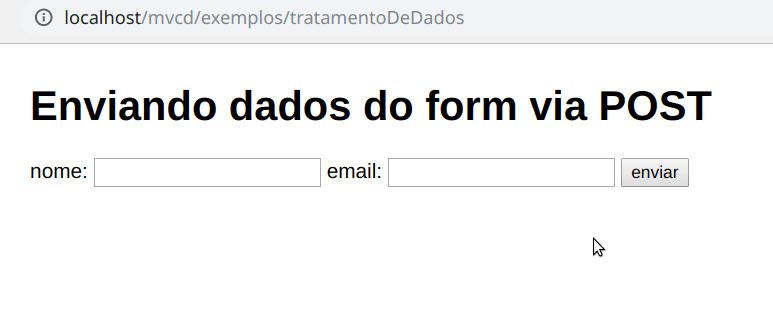
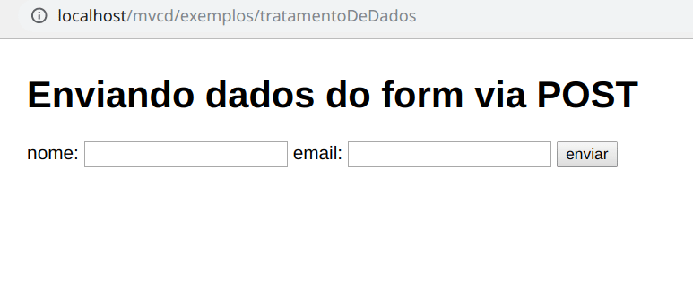

MVCd - MVC desorientado
=======

Este é um projeto desenvolvido com propósito educacional e não deve ser usado em projetos reais. A ideia geral do projeto é apresentar as ideias e conceitos de arquitetura, modelos e framework para alunos que ainda não conhecem a orientação a objetos.
 
## Estrutura do projeto
A estrutura do projeto é ilustrada abaixo:

    mvcd/
    ├── biblioteca/
    │   ├── bd/
    |   |   └── script_banco.sql
    │   ├── acesso.php
    │   ├── alert.php
    │   ├── mysqli.php
    │   ├── uteis.php
    │   └── visao.php
    └── controlador/
    │   ├── usuarioControlador.php
    │   └── loginControlador.php
    └── modelo/
    │   └── usuarioModelo.php
    └── publico/
    │   ├── css/
    |   |   └── app.css
    │   └── js/
    |      └── app.js
    └── servico/
    └── visao/
    │   ├── login/
    |   |   └── index.visao.php
    │   ├── paginas/
    |   |   └── inicial.visao.php
    │   ├── usuario/
    |   |   ├── formulario.visao.php
    |   |   ├── listar.visao.php
    |   |   └── visualizar.visao.php
    |   ├── cabecalho.php
    |   └── template.php
    ├── .htaccess
    ├── app.php
    ├── index.php
    └── readme.md

O framework utiliza o padrão arquitetural MVC, logo sua estrutura básica apresenta os três principais objetos da arquitetura, representados pelas pastas `modelo`, `controlador` e `visao`. 

## Rotas
As rotas sao convencionadas a seguir o padrão:
`http://localhost/<PASTA_PROJETO>/<CONTROLADOR>/<ACAO>`

`<PASTA_PROJETO>`: o nome da pasta em que os arquivos estão, por padrão o nome que está se você baixar os arquivos é `mvcd-master`. Recomenda-se que você troque essa nomenclatura para uma que identifique o seu projeto.

`<CONTROLADOR>`: nome do controlador que atenderá essa requisição. Cada controlador é representado por um arquivo com a convenção do nome em camelCase no padrão: `<nomeControlador>Controlador.php` exemplo: `usuarioControlador.php`.

`<ACAO>`: ação do controlador que atenderá a requisição em questão. Se o valor for vazio, ou seja, chamar apenas com o nome do controlador, o framework espera por padrão uma ação chamada `index`. Seu controlador pode ter quantas ações (funções) que você achar necessário.

O noopmvc utiliza o padrao Front Controller, isso significa que todas as requisições (uma requisicao é qualquer chamada para algum recurso do seu site - uma URL) irão ser atendidas pelo mesmo arquivo, no caso o arquivo `index.php`. Ele será o responsável por tratar essa requisição e repassar para o controlador específico que vai lidar com aquela requisição. Voce não deve alterar o arquivo `index.php` a menos que tenha certeza absoluta do que esta fazendo.

Por exemplo: uma requisicao tipo GET para a URL `http://localhost/seuprojeto/usuario` sera tratada pelo arquivo `index.php` e estará esperando obrigatoriamente um arquivo armazenado na pasta `controladores` na raiz do projeto e com o nome `usuarioControlador.php`. **Você deve seguir seguir essa convenção!**

## Como começar?

1. Primeiramente você deve baixar os arquivos do framework. Sempre procure baixar os arquivos da última versão, você pode encontrar eles na aba **releases** ou pelo linK https://github.com/danilocbueno/mvcd/releases.
2. Baixe o arquivo chamado `mvcd.zip`
3. Extraia os arquivos na pasta do seu servidor de apliação PHP. Por exemplo, se estiver utilizando o WAMP a pasta padrão é `c:/wamp/www/`.
4. Renomeie a pasta dos arquivos com o nome do seu projeto, por exemplo `webloja`.

## Tratamento de dados com PHP

A validação dos dados é uma parte essencial para qualquer aplicação Web que aceite dados dos usuários. Os dados **DEVEM** ser validados após submissão do formulário, antes de serem processados! 

Os usuários podem ser descuidados, maliciosos, e fabulosamente mais criativo (muitas vezes acidentalmente) do que você pode imaginar quando você está projetando sua aplicação.

Veja o exemplo utilizando framework MVCd. Abaixo está um pedaço do arquivo `exemplosControlador.php` destacado na ação `tratamentoDeDados`. Logo para acessar essa ação você deve acessar sua app através da URL: `http://localhost/webloja/exemplos/tratamentoDeDados`

```php
function tratamentoDeDados() {

    if(ehPost()) {
        //aqui os dados foram submetidos!
        $nome = $_POST["nome"];
        $email = $_POST["email"];

        echo "Nome via POST: " . $nome;
        echo "<br>Email via POST: " . $email;
        
    } else {
        //aqui não existem dados submetidos!
    }
    exibir("exemplos/enviarDados");
}
```

Aqui tem o exemplo do arquivo `enviarDados.visao.php` utilizado no controlador.

```html
<h1>Enviando dados do form via POST</h1>
<form method="post" action="">
    nome: <input type="text" name="nome">
    email: <input type="text" name="email">
    <button type="submit">enviar</button>
</form>
```
Perceba que nesse momento não existe nenhum tipo de validação dos dados da sua aplicação, ou seja nada garante que o usuário irá inserir um valor no campo nome ou mesmo um e-mail válido como no exemplo mostrado abaixo:



Perceba que os dados são submetidos mesmo sem de fato existirem dados, ou seja, os dados serem espaços em branco. 

Para contornar essa situação precisamos garantir o mínimo de validação dos dados. Para isso tempos diversos tipos de validação que podem ser realizadas, aqui vamos ver três tipos: **campos obrigatórios**, **campos de um tipo específico** e **validação HTML e JS**.

### Campos obrigatórios
Para certificar-se de que algo foi inserido em um elemento requerido, vamos utilizar duas funções do PHP: `strlen()` e `trim()`.

A função [strlen()](https://www.php.net/manual/pt_BR/function.strlen.php) retorna o número de caracteres de uma string. Já a função [trim()](https://www.php.net/manual/pt_BR/function.trim.php) remove espaços em branco e outros caracteres predefinidos de ambos os lados de uma string.

Veja abaixo um exemplo de utilização das funções:

```php
$nome = "Lisa Maria";
$numeroCaracteresDaString = strlen($nome);
echo $numeroCaracteresDaString; // 10

$textoComEspaco = " Lisa Maria ";
$textoSemEspaco = trim($textoComEspaco);
echo $textoSemEspaco; // Lisa Maria
```
Agora vamos utilizar as funções no framework para validar os campos de nome e email para serem obrigatórios. Veja as alterações que realizamos:

```php
function tratamentoDeDados() {

    if(ehPost()) {
        //aqui os dados foram submetidos!
        $nome = $_POST["nome"];
        $email = $_POST["email"];

        if(strlen(trim($nome)) == 0) {
            echo "Nome inválido<br>";
        }

        if(strlen(trim($nome)) == 0) {
            echo "Email inválido";
        }

        echo "<br>Nome via POST: " . $nome;
        echo "<br>Email via POST: " . $email;
        
    } else {
        //aqui não existem dados submetidos!
    }
    exibir("exemplos/enviarDados");
}
``` 
Tente novamente agora fazer a submissão de dados vazios via formulário, veja que no novo resultado temos uma mensagem para o usuário que as informações não estão corretas!



Perceba que agora estamos validando os campos obrigatórios porém estamos repetindo nosso código e também não temos uma lógica para tratar esses casos de erros.